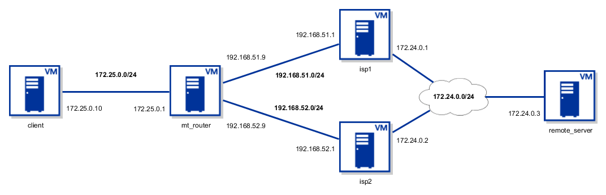

:warning: `client` and `remote_server` have autostart disabled, use `vagrant up client remote_server` to bring them up.
### Network diagram


* vagrant-lan: 172.25.0.0/24
* vagrant-isp1-intnet: 192.168.51.0/24
* vagrant-isp2-intnet: 192.168.52.0/24
* vagrant-inter_isp-intnet: 172.24.0.0/24

### Adding additional VMs to Inter-ISP network
#### Mikrotik
```ruby
# -*- mode: ruby -*-
# vi: set ft=ruby :

Vagrant.configure("2") do |config|
  config.vm.box = "cheretbe/routeros"
  config.vm.provider "virtualbox" do |vb|
    vb.customize ["modifyvm", :id, "--groups", "/__vagrant"]
  end
  config.vm.network "private_network", virtualbox__intnet: "vagrant-inter_isp-intnet", auto_config: false
end
```
```
vagrant ssh

/interface print detail

/interface ethernet set [find name="ether3"] name="inter_isp"
/ip address add address="172.24.0.10/24" interface="inter_isp"

/routing ospf interface add hello-interval=1s interface=inter_isp

/routing ospf instance set 0 router-id=172.24.0.10

add address=172.24.0.10/24 interface=inter_isp network=172.24.0.0
```
